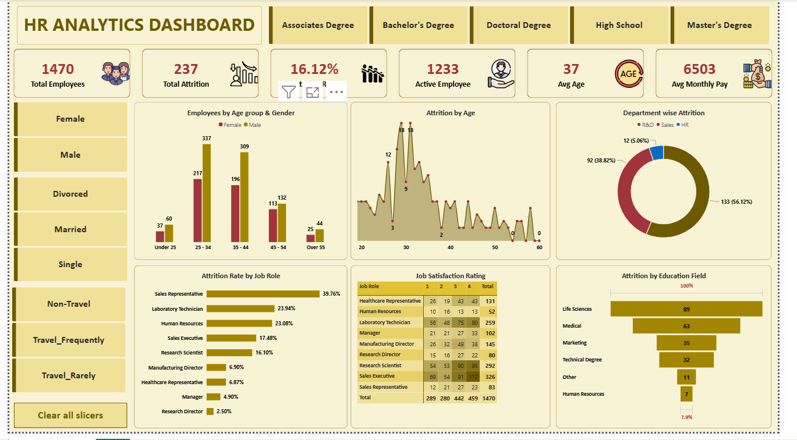

# HR Analytics Dashboard – Power BI

## 📊 Project Overview

This project is an interactive HR Analytics Dashboard developed using Microsoft Power BI.

The dashboard provides insights into employee demographics, employee attrition, job roles, job satisfaction, education, departments, travel status, and salary-related metrics.

The goal of this project is to transform HR data into meaningful visual insights that can support workforce analysis and data-driven decision-making.

## 🛠️ Tools & Technologies

- Power BI
- Power Query
- DAX
- SQL
- Microsoft Excel
- Data Visualization
- Data Analysis
## 📌 Key KPIs

The dashboard provides the following key metrics:

- Total Employees: 1,470
- Total Attrition: 237
- Attrition Rate: 16.12%
- Active Employees: 1,233
- Average Age: 37
- Average Monthly Pay: 6,503
## 📈 Dashboard Analysis

The dashboard includes analysis of:

### Employee Demographics
- Employee count by age group
- Gender distribution
- Marital status
- Education level

### Employee Attrition
- Overall attrition rate
- Attrition by age
- Attrition by department
- Attrition by job role
- Attrition by education field

### Employee Satisfaction
- Job satisfaction rating
- Satisfaction by job role

### Workforce Analysis
- Active employees
- Average employee age
- Average monthly pay
- Business travel analysis
## 🎯 Key Dashboard Features

- Interactive slicers
- KPI cards
- Bar charts
- Donut charts
- Line charts
- Matrix/table visualization
- Cross-filtering
- Interactive dashboard navigation
## 🧹 Data Preparation

The dataset was prepared and transformed using Power Query.

The data preparation process included:

- Data cleaning
- Removing unnecessary fields
- Checking missing values
- Data type transformations
- Creating calculated fields
- Preparing data for visualization
## 📊 Power BI Development

The dashboard was created using:

- Power Query for data transformation
- DAX for calculations and KPIs
- Interactive visualizations
- Slicers and filters
- Dashboard formatting and design

## 📷 Dashboard Preview




## 📁 Project Structure

```text
HR-Analytics-PowerBI-Dashboard/
│
├── README.md
├── PowerBI/
│   └── HR_Analytics_Dashboard.pbix
├── Dataset/
│   └── HR_Analytics_Data.csv
├── Dashboard/
│   └── HR_Analytics_Dashboard.png
└── Documentation/
    └── Project_Overview.md
